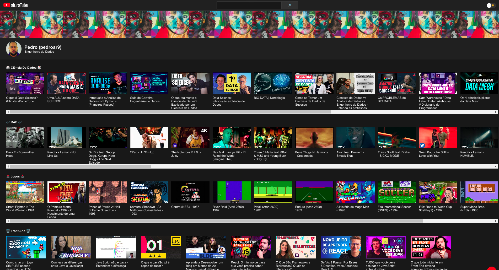
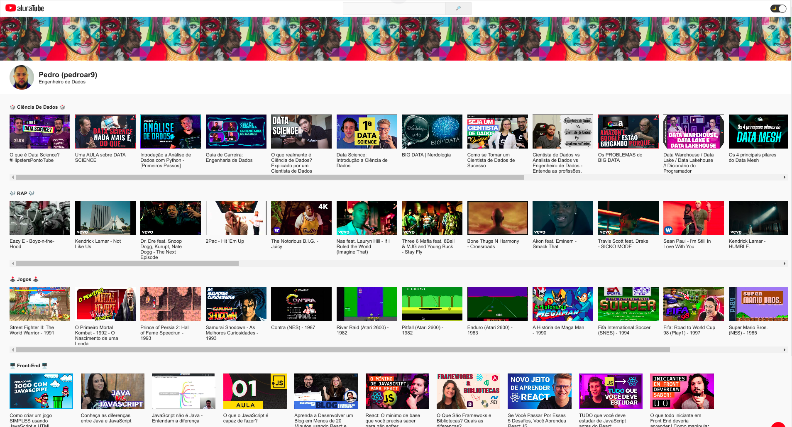

## 🚀 Tecnologias

              

## 💻 Projeto de imersão em ReactJS

O AluraTube é uma projeto da imersão da Alura, projeto desenvolvido durante a imersão Alura com o objetivo de criar uma versão customizada da plataforma YouTube com o layout distribuido por meio do [figma](https://www.figma.com/file/1acrju7CLwHkSh6e7xEk9h/Aluratube?node-id=0%3A1) utilizando React e NextJS.  
Os vídeos iniciais são pegados dentro de um arquivo que armazena os dados necessários para que o site consiga retorna-los, chamado de JSON, dentro dela também é possível pegar a foto do meu perfil do GitHub.

### 🌘 Dark Mode



### ☀️ Light Mode



- Podemos fazer algumas interações no site, como filtrar os vídeos no campo de busca, mudar o tema do site cliclando no botão acima que vai de Dark Mode e Light Mode.

## ⚙️ Requisitos para execução

### Como rodar o projeto localmente?

Primeiramente é preciso cumprir  os seguintes requisitos:
- Possuir o `nodejs` instalado
- Ter todas as dependências instaladas

Primeiro, clone esse repositório utilizando a seguinte linha no terminal:

  ```
  git clone https://github.com/pedroar9/imersaoreact.git
  ```

- Instalação das bibliotecas via npm (obtido com a instalação do Node.JS);

```bash
npm install next react react-dom styled-components @supabase/supabase-js
```

- Instalação das depências que faltar para executar

```bash
npm i ou npm install
```

- Para rodar o projeto localmente:

```bash
npm run dev
```

- 🌐 Para verificar o projeto rodando, acesse no navegador:  
<http://localhost:3000>

## 📌 Onde está o Layout base do projeto?

- [Link para Figma do projeto](https://www.figma.com/file/1acrju7CLwHkSh6e7xEk9h/Aluratube?node-id=0%3A1)

## © Licença


## 📍 Onde me encontrar

<div>
<a href="https://github.com/pedroar9/" target="_blank"></a>
<a href="mailto:pedrocarlos.assis@gmail.com)"></a>
<a href="https://www.linkedin.com/in/pedrocarlos-assis/"></a>
<a href="https://www.youtube.com/@pedroar9"></a>
</div>
